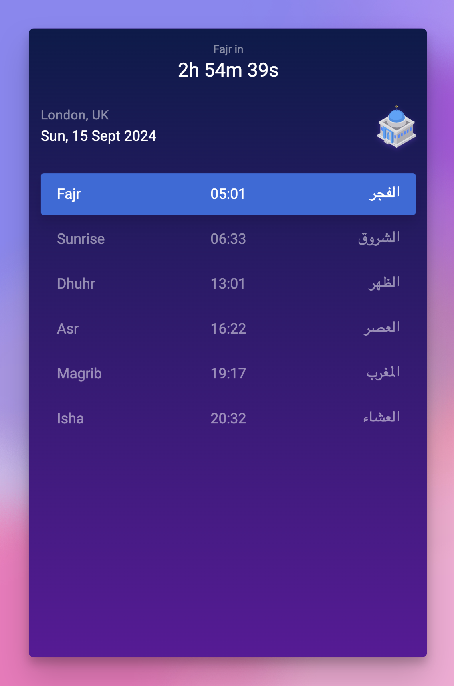
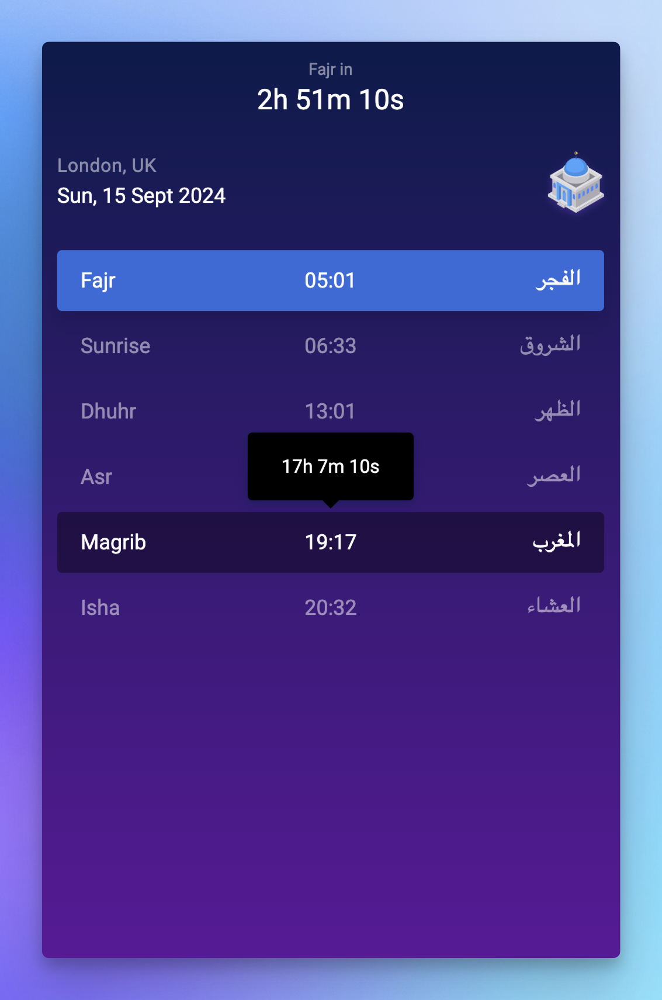

# Athan

Lightweight PWA for checking daily Islamic prayer times in London.

## Demo





## Tech Stack

- **Nuxt.js**: A framework for creating Vue.js applications.
- **Pinia**: A state management library for Vue.js.
- **Day.js**: A minimalist JavaScript library for date and time manipulation.
- **Epic Spinners**: A collection of loading spinners with Vue.js integration.
- **Tiny Timer**: A small timer library.
- **Vue Tippy**: A tooltip directive for Vue.js.
- **Tailwind CSS**: A utility-first CSS framework.
- **Vite PWA**: A plugin for integrating Progressive Web App (PWA) features.
- **Google Fonts**: Integration for using Google Fonts in the application.
- **Vercel Analytics**: Analytics for Vercel deployments.

## Setup

Make sure to install the dependencies:

1. Install dependencies using yarn:

    ```bash
    yarn install
    ```

2. Start the development server:

    ```bash
    yarn run dev
    ```

3. Open your browser and navigate to:

    ```
    http://localhost:3000
    ```